# Final Project: Dancing Ghost!

For our final project in Lets Print Robots we will make a dancing ghost robot. 

# Step 1

Make a box 20 x 40 x 14

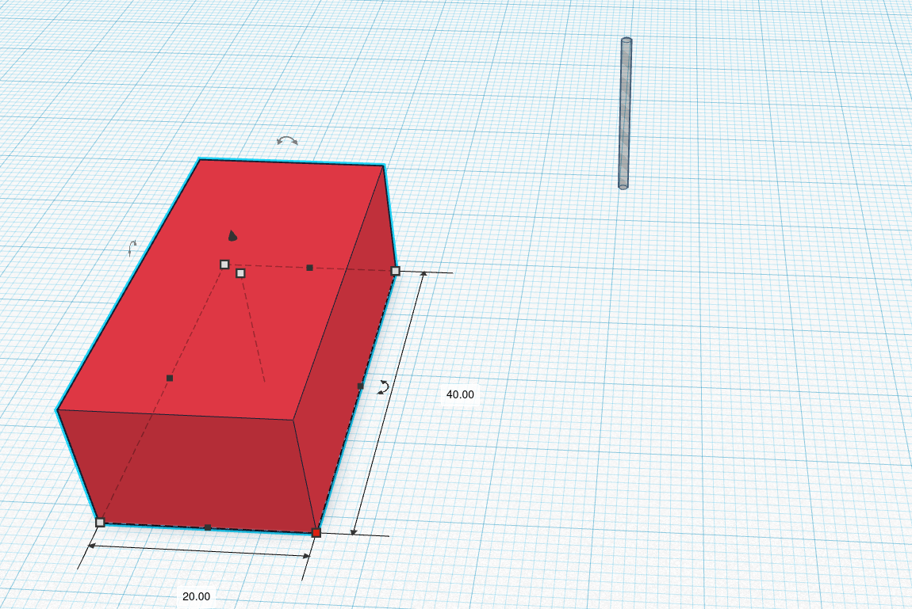

put a small hole in the coner of the block. This will be  used for allignment later. 

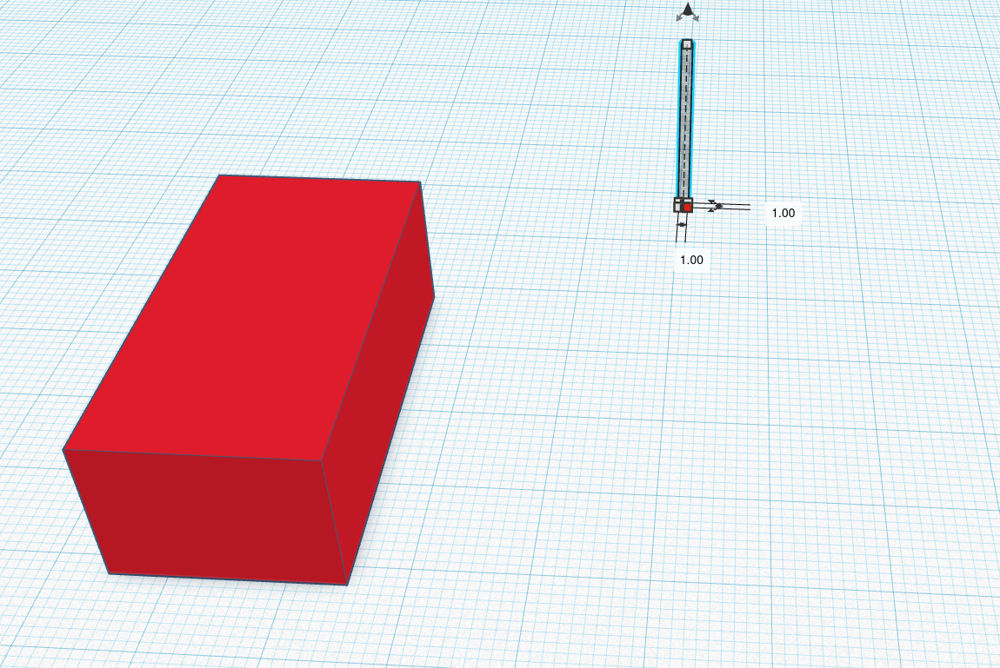

# Step 2

Add the servo vitamin

Make sure the servo is sticking out 5mm on the side where the servo horn will stick out. 

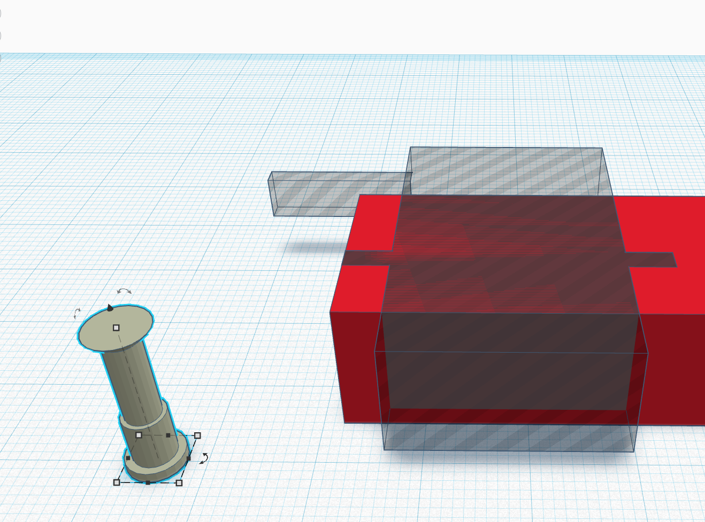

# Step 3

Make the bolts with heat set inserts into holes, make 4 copies

Cut the holes out of the bottom bracket. 

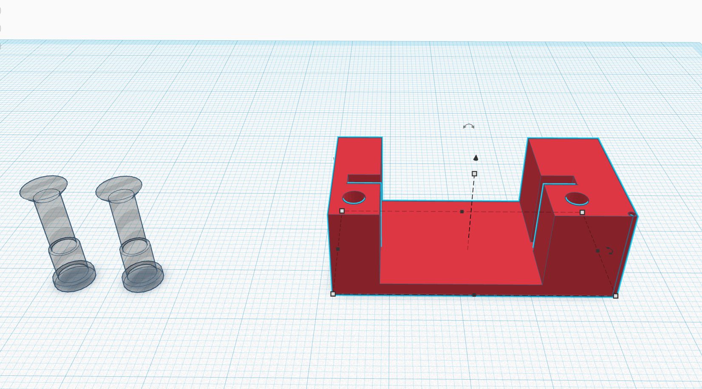

# Step 4

Make a cover plate for the servo

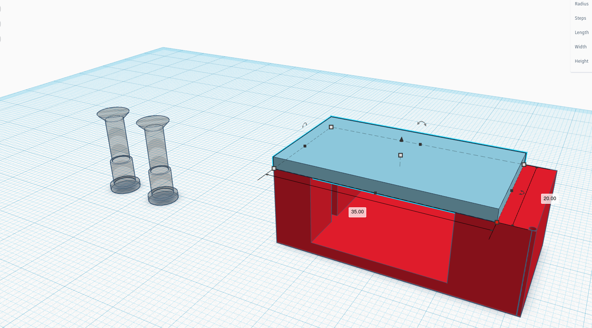

Use the bottom of the bracket to allign the 2 remaining bolt-insert assemblies

Group the 2 alligned bolts to the cover plate

Add your name to the cover plate and to the bracket

Move the cover plate away from the bracket and place it on the print surface

Make 3 copies of the cover plate

# Step 5

Copy and paste the servo block and rotate it 120 degrees

use the corner pin to visually allign the 2 servo blocks

Copy and paste the servo block, this time rotate -120 degrees

use the allignment hole to visually allign the third block

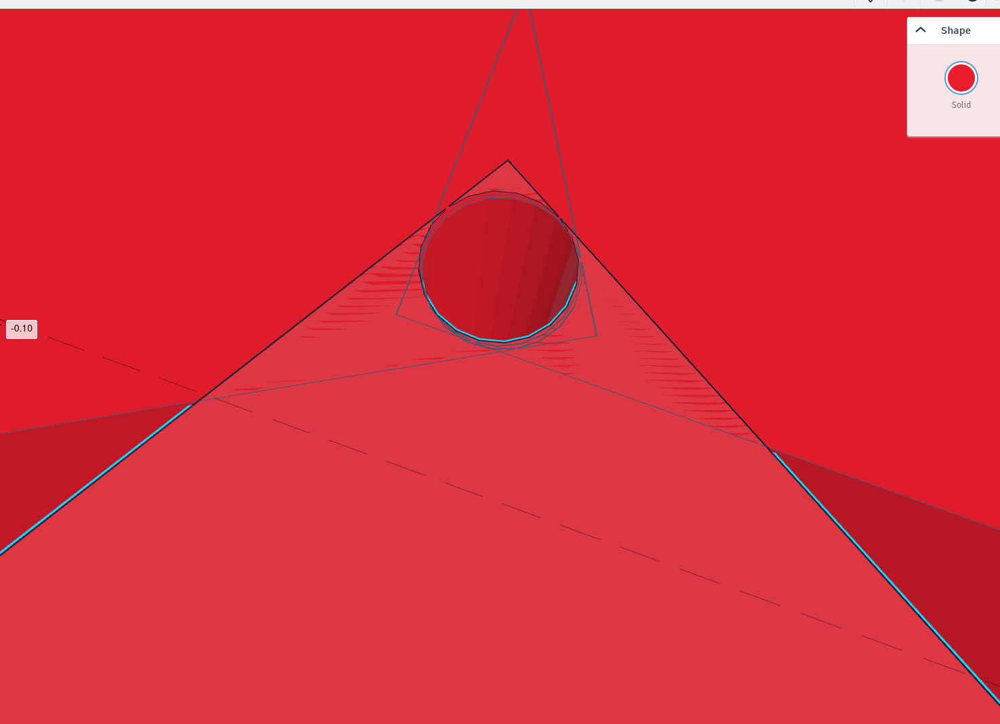

Make a 10 x 10 x 14mm cylinder 

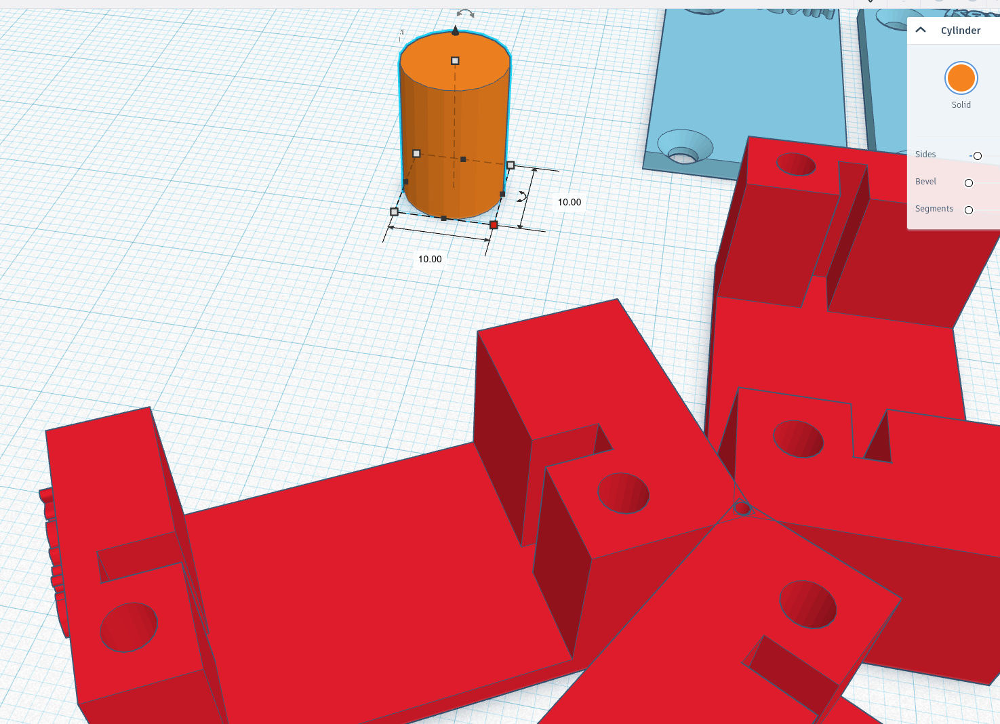

Move it to the middle of the 3 blocks

Group the 3 blocks and support cylinder

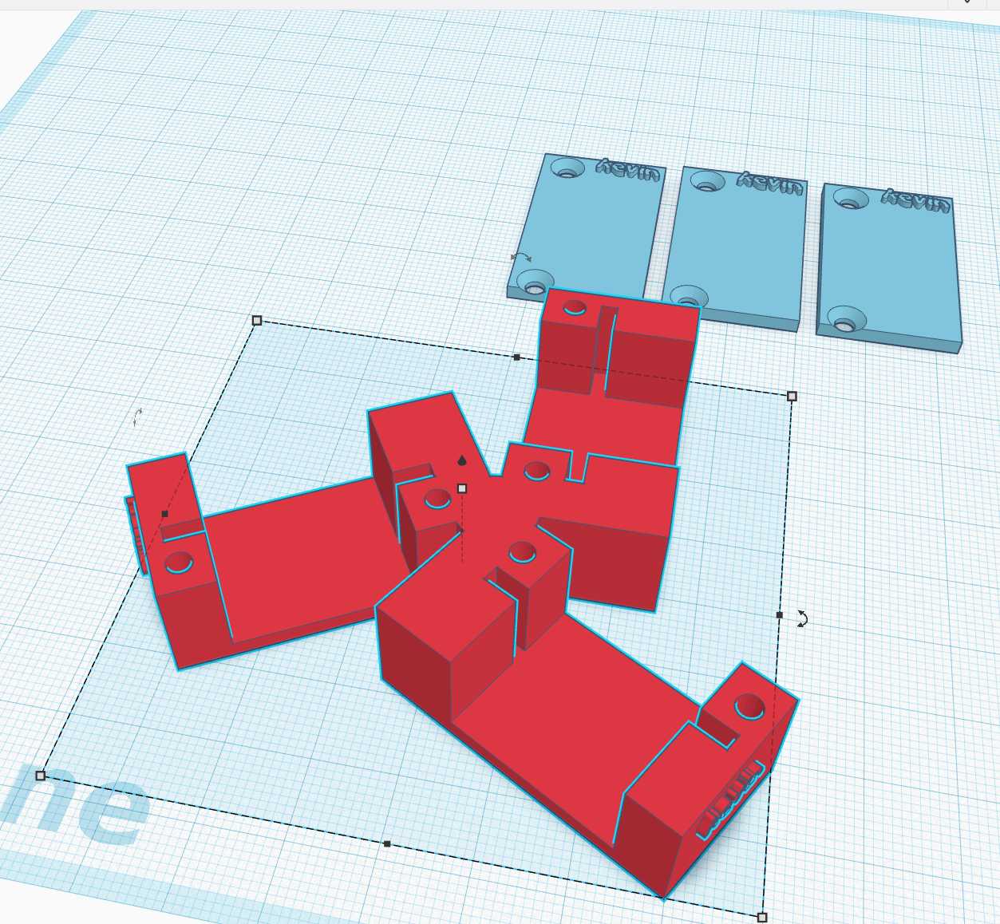

# Step 6

Use the Spring vitamin to cut a small divit in the center of the servo blocks

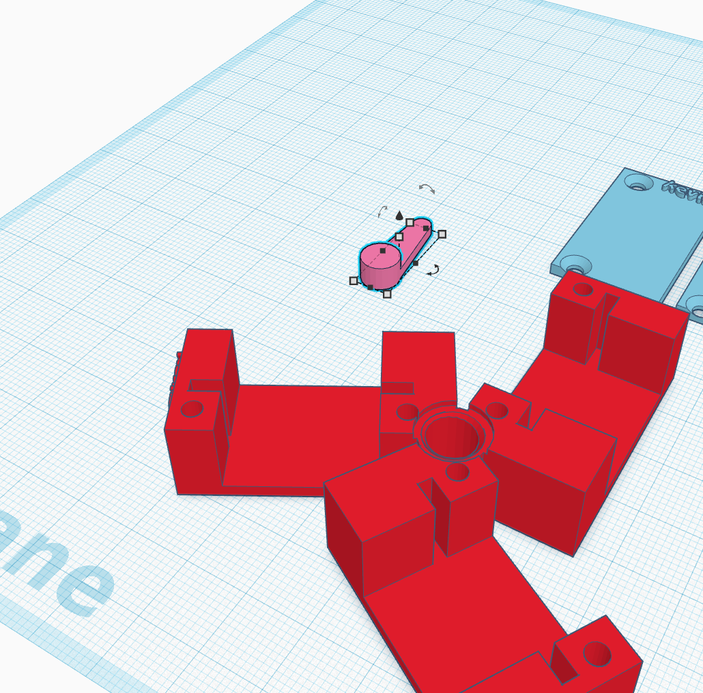

Load the horn vitamin and make it a hole

Make the block 2mm bigger than the horn in  x and y, and exactly the same height. Allign on centers with the horn

# Step 7

Bring in the ball chain vitamin and make it a hole

Make a cylinder that is 5.5x5.5x the height of the horn block

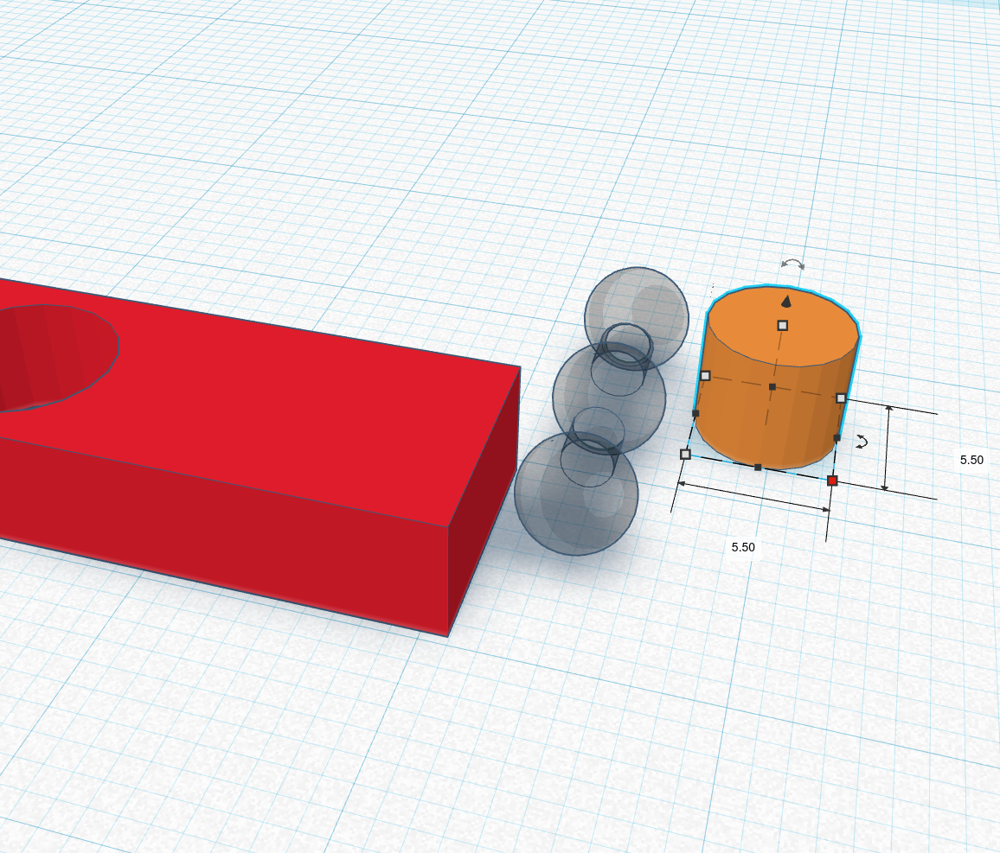

Move the ball chain into place so it cuts a recess for the balls on either side of the support cylender

Make a small cube hole to cut out the path for the cord to travil through during assembly

# Step 8

Duplicate the ball chain connection for use on the end effector

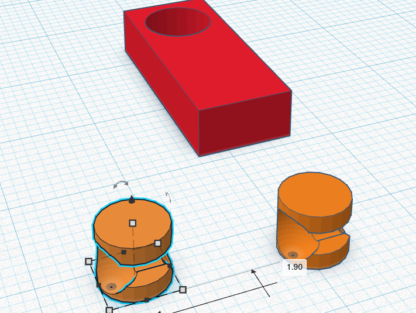

This is a model of a Pancil. Make it a hole. 

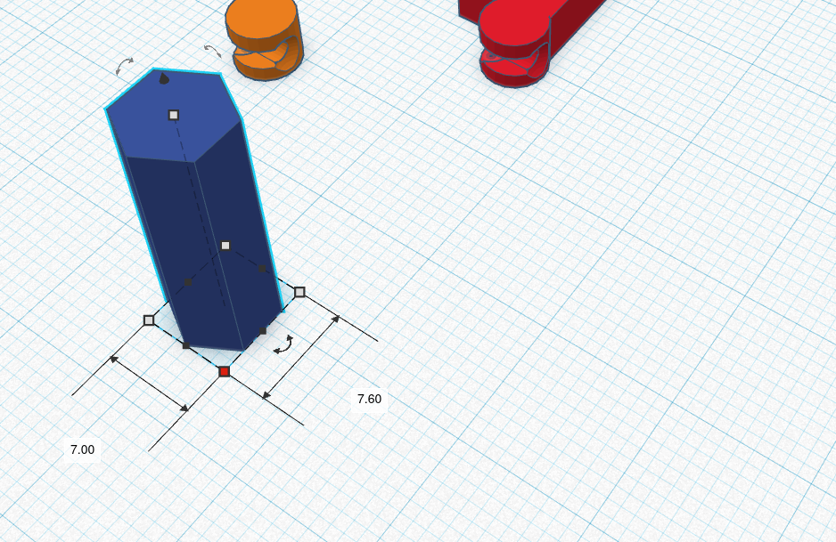

Bring in a half-sphere zided 20x20x10

Allign the pencil and the hemisphere

Drop the spring down so it is just 1 mm above the grid

Select the pencil, the spring and the hemisphere and using the allign tool, allign all 3 to the center in X and Y

# Step 9

Group the ball chain and the block from step 7 and angle it to 45 degrees

raise it up so it is aligned to the hemisphere as shown

Make 3 coppies after tilting the ballchain

Rotate the 2 copies to 120 and -120 respectivly

use the points of the hexagon to allign them to to the end effector

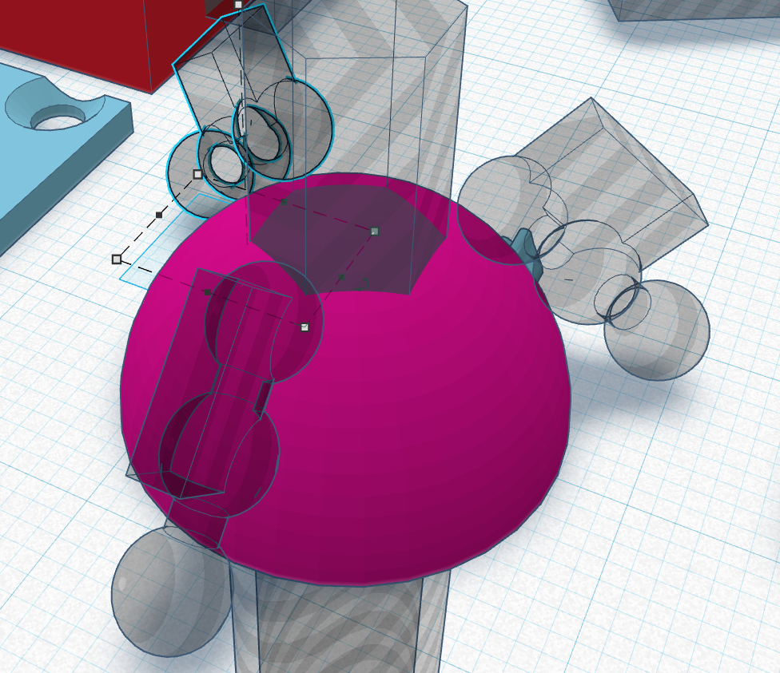

use the ring shape with a tube of 2.75 and 20 x 20 size

raise the ring up 6 mm

Allign the ring to the middle of the end effector

Group the end effector together to finish it. 

# Step 10

Arrange the print bed so all the items are within a 120 x 90 mm footprint

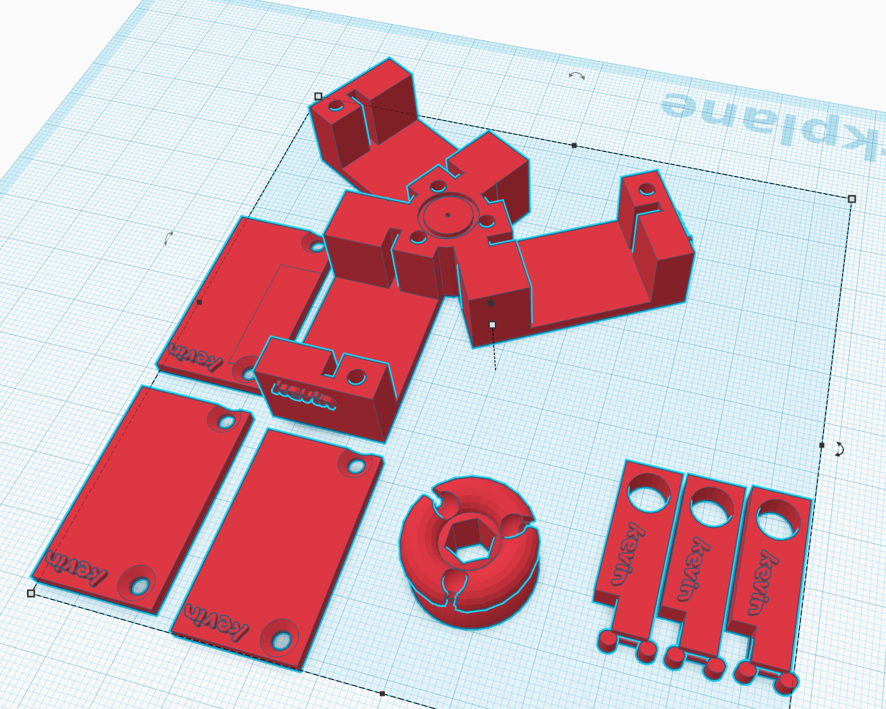