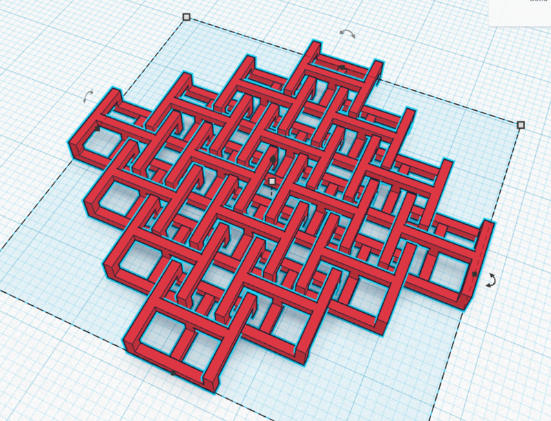
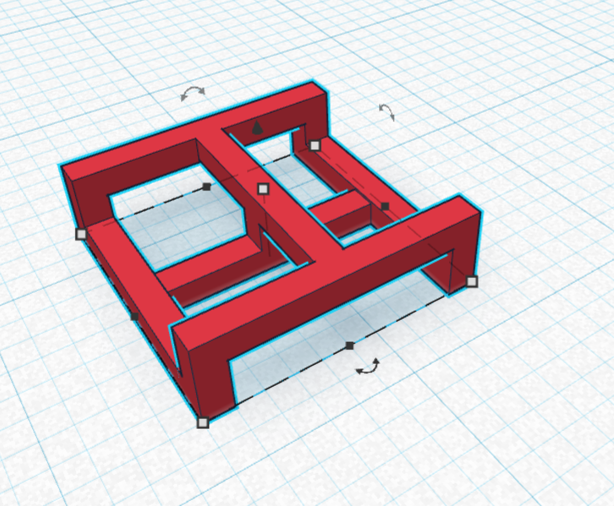
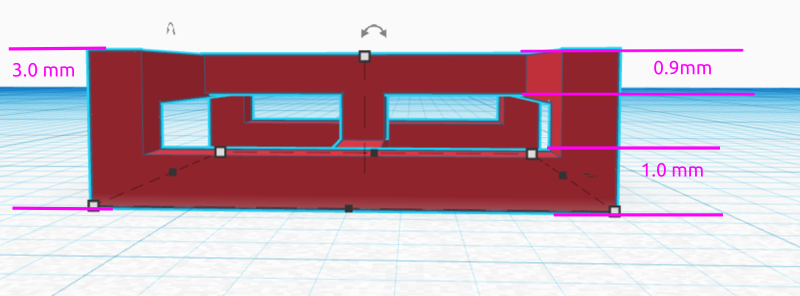
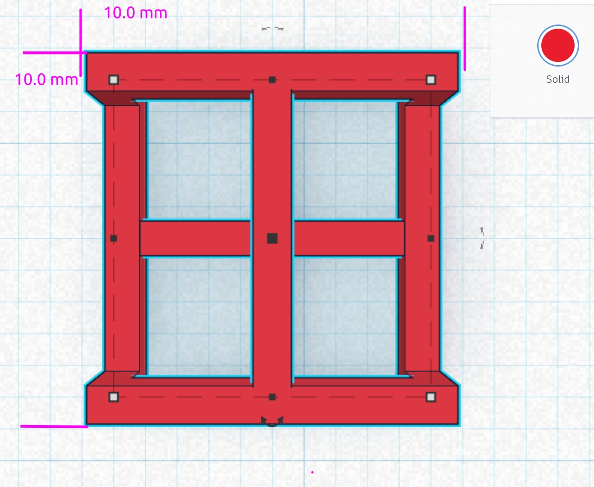

# Lets Chaim Mail!

We will not make a link for a 3d printable chain mail. 

# 1 Use these Drawings to get your dimentions

# 2 Make the bottom of link using blocks and the allign tool

Make the blocks you will need to make the link

2 x Edge Blocks

1 x Cross Block

5 x Riser Blocks 

Use the allign tool to allign the cross block to the first Edg block

Group the Alligned edge and cross block

Use the allign tool to allign the second cross block

Group the 3 shapes of the base together to form the "Bottom H-block"

Allign the first riser block to the center of the H-block

Group the center riser to the H-block

Allign the remaining risers to the corners, grouping after each riser is alligned

# 3 Duplicate the H-Block to form the  link

Take the second H-Block and flip it upside-down

Rotate the upside-down block 90 degrees so tht it goes from "H" to "I" shape (Rotate it around the Z axis)

Use the allign tool to center the H and I blocks together. 

Group the H and I blocks to form the link

# 4 Build the chain mail from the links

DO NOT DRAG AND DROP, use the arrow keys to move links

Duplicated the Link 

Set the snap grid to 0.5mm

Move the link using the arrow keys until the link corner of the moving link is centered in the equare hole of the stationary link

Group the 2 links together

Duplicate the 2 links

Use the arrow keys to move the links so that the corner of one link is in the center of the remaining links

Group the 4 links together

Repeat until you have a 4 x 4 piece of chainmail

