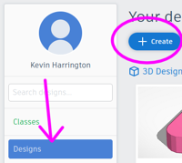
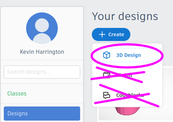
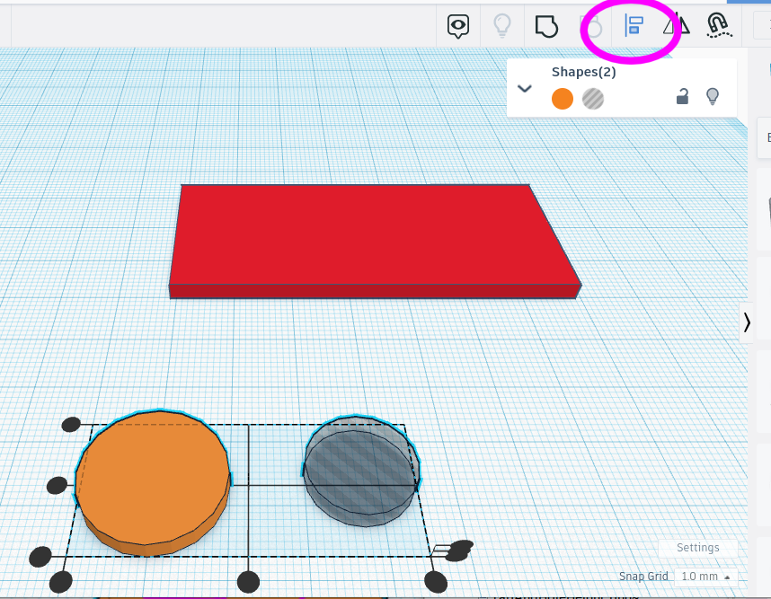

# Lets Make a Nametag!

For our first assignment we will be using TinkerCAD to make a nametag. We will be taking the nametag that we make together and print them with a 3d printer. 

# 1) Sign In to Google Classroom

Your instructor will add you to the class, it will show up in your google classroom

# 2) Create your Tinkercad account

sign up for an account

Select personal account

Click on the Google "G" 

\pagebreak

# 3) Join the  class

Go to Google Classroom

Find the "Join the Class" assignment

click the link to join the class

# 4) Create a new Design

On the Left side click on the "Designs" section

Click the "Create" button

Select 3d Design

\pagebreak

# 5) Set the name of the file

In the top left corner

Set the name to Your first name, Your Last name and the word "Nametag"

\pagebreak

# 6) Add the Base of the nametag

Add a box to the workplane. Cick on Bok on the right, and click on the blue workplane to place it.

Click on the white square in the corner, when you do, the numbers will show up. Click on the number and type the number it should be. 

Set it to 70mm by 30mm

Set the Height of the nametag base to 3mm

\pagebreak

# 7) Add a tab and a hole

Grab one Cylinder and one Cylinder Hole

Set the Hole dimension to 15mm by 15 mm

Set height of Tab and the hole to 3mm

\pagebreak

# 8) Allign the tab and hole

Highlight the tab and hole

Select the allign tool 

Allign In X

Allign In Y

Move the box after allignment

Select all and click the Group button

See that you have the base of a nametag

\pagebreak

# 9) Scribble your Name

Click on the Scribble tool and click the top of the nametag to place it

Use the pencil tool and scribble your name. Click done when you are finished

Set the height of the name to 3mm

Adjust the corners so the name fits entirely on the base. Drag and drop to adjust

Select all and Group

\pagebreak

# 10) Export STL file

Click export and select .stl

\pagebreak

# 11) Submit STL to Google Classroom

In Google Classroom Submit your STL file to complete the assignment

Look for "Lets Make Nametags!" assignment

Submit a file

Select Upload file

Browse for the file

Look in your "Downloads" folder

Select the file

Submit the assignment once uploaded. 

# 12 All Done!

Your nametag will be printed on the 3d printer in the next batch!

